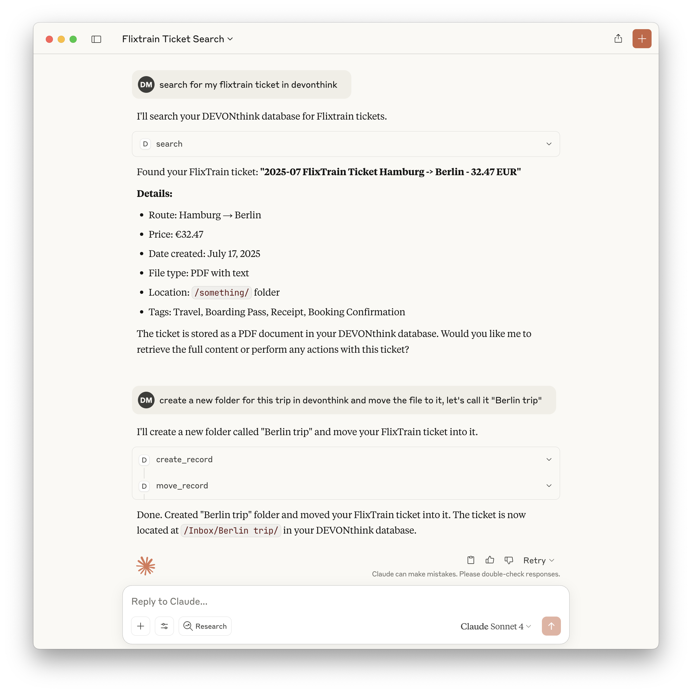

# DEVONthink MCP Server

This MCP server provides access to DEVONthink functionality via the Model Context Protocol (MCP). It enables listing, searching, creating, modifying, and managing records and databases in DEVONthink Pro on macOS.



## Features

- Exposes a comprehensive set of DEVONthink operations as MCP tools
- List, search, and look up records by various attributes
- Create, delete, move, and rename records and groups
- Retrieve and modify record content, properties, and tags
- Create records from URLs in multiple formats
- List open databases and group contents
- All tools are type-safe and validated with Zod schemas

## Tools

### Core Tools

1. `is_running`

   - Checks if DEVONthink is currently running
   - No input required
   - Returns: `{ "success": true | false }`

2. `create_record`

   - Creates new records (notes, bookmarks, groups) with specified properties
   - Input: record type, name, parent group, and optional metadata

3. `delete_record`

   - Deletes records by ID, name, or path
   - Input: record identifier

4. `move_record`

   - Moves records between groups
   - Input: record ID and destination group

5. `get_record_properties`

   - Retrieves detailed metadata and properties for records
   - Input: record identifier

6. `search`

   - Performs text-based searches with various comparison options
   - Input: query string and search options

7. `lookup_record`

   - Looks up records by filename, path, URL, tags, comment, or content hash (exact matches only)
   - Input: lookup type and value

8. `create_from_url`

   - Creates records from web URLs in multiple formats
   - Input: URL and format options

9. `get_open_databases`

   - Lists all currently open databases
   - No input required

10. `list_group_content`

    - Lists the content of a specific group
    - Input: group identifier

11. `get_record_content`

    - Retrieves the content of a specific record
    - Input: record identifier

12. `rename_record`

    - Renames a specific record
    - Input: record ID and new name

13. `add_tags`

    - Adds tags to a specific record
    - Input: record ID and tags

14. `remove_tags`

    - Removes tags from a specific record
    - Input: record ID and tags

15. `classify`

    - Gets classification proposals for a record using DEVONthink's AI
    - Input: record UUID, optional database name, comparison type, and tags option
    - Returns: Array of classification proposals (groups or tags) with scores

16. `compare`
    - Compares records to find similarities (hybrid approach)
    - Input: primary record UUID, optional second record UUID, database name, and comparison type
    - Returns: Either similar records (single mode) or detailed comparison analysis (two-record mode)

### Example: Search Tool

```json
{
  "query": "project plan",
  "comparison": "contains",
  "database": "Inbox"
}
```

Returns:

```json
{
  "results": [
    { "id": "123", "name": "Project Plan", "path": "/Inbox/Project Plan.md" }
  ]
}
```

## Getting Started

### Prerequisites

1. **DEVONthink Pro** - The DEVONthink application must be installed and running
2. **Node.js** (v18 or later) - Required to run the MCP server

### Installation

#### Option 1: Install from npm (Recommended)

```bash
npm install -g mcp-server-devonthink
```

Then add to your Claude configuration:

```json
{
  "mcpServers": {
    "devonthink": {
      "command": "mcp-server-devonthink"
    }
  }
}
```

#### Option 2: Use via npx

Add to your Claude configuration:

```json
{
  "mcpServers": {
    "devonthink": {
      "command": "npx",
      "args": ["-y", "mcp-server-devonthink"]
    }
  }
}
```

#### Option 3: Local Development Setup

If you want to modify or contribute to this project:

1. **Clone the repository:**
   ```bash
   git clone https://github.com/dvcrn/mcp-server-devonthink.git
   cd mcp-server-devonthink
   ```

2. **Install dependencies:**
   ```bash
   npm install
   ```

   *Note: The project specifies Yarn as the package manager, but npm works fine for installation.*

   **Important**: You must run `npm install` before building, as it installs TypeScript (`tsc`) and other build tools.

3. **Build the project:**
   ```bash
   npm run build
   # or use the justfile if you have just installed
   just build
   ```

4. **Test the server:**
   ```bash
   node dist/index.js
   ```

   The server should start without errors. Press Ctrl+C to stop.

5. **Add to Claude configuration:**
   ```json
   {
     "mcpServers": {
       "devonthink": {
         "command": "node",
         "args": ["/path/to/mcp-server-devonthink/dist/index.js"]
       }
     }
   }
   ```

### Claude Configuration

Your Claude Desktop configuration file is located at:
- **macOS**: `~/Library/Application Support/Claude/claude_desktop_config.json`

Create or update this file with the MCP server configuration. Choose the configuration that matches your installation method:

**Option 1: Global npm installation**
```json
{
  "mcpServers": {
    "devonthink": {
      "command": "mcp-server-devonthink"
    }
  }
}
```

**Option 2: Using npx**
```json
{
  "mcpServers": {
    "devonthink": {
      "command": "npx",
      "args": ["-y", "mcp-server-devonthink"]
    }
  }
}
```

**Option 3: Local development setup**
```json
{
  "mcpServers": {
    "devonthink": {
      "command": "node",
      "args": ["/path/to/mcp-server-devonthink/dist/index.js"]
    }
  }
}
```
*Replace `/path/to/mcp-server-devonthink` with your actual project directory path.*

## Usage with Claude Desktop

1. **Start DEVONthink** - Ensure DEVONthink Pro is running
2. **Restart Claude Desktop** - After updating the configuration
3. **Test the connection** - In Claude, try asking: "Is DEVONthink running?"

If everything is set up correctly, Claude should be able to use the `is_running` tool and confirm that DEVONthink is active.

## Usage with Claude Code

Claude Code users can install this MCP server using the command-line interface. Based on testing experience, here's the complete setup process:

### Prerequisites

- Ensure Claude Code CLI is installed and working (`claude --version`)
- DEVONthink Pro must be running

### Installation

Choose the installation method that matches your setup:

**Option 1: Global npm installation**
```bash
npm install -g mcp-server-devonthink
claude mcp add devonthink -- mcp-server-devonthink
```

**Option 2: Using npx (no installation required)**
```bash
claude mcp add devonthink -- npx -y mcp-server-devonthink
```

**Option 3: Local development setup**
```bash
# After cloning and building the project locally
claude mcp add devonthink -- node /path/to/mcp-server-devonthink/dist/index.js
```

### Scope Configuration

By default, MCP servers are added with **local scope** (only available in the current project directory). For global availability:

```bash
claude mcp add devonthink --scope user -- node /path/to/mcp-server-devonthink/dist/index.js
```

### Verification & Testing

1. **Check server status:**
   ```bash
   claude mcp list
   ```
   You should see: `devonthink: ✓ Connected`

2. **Test in Claude Code:**
   - Use `/mcp` command to verify server connection
   - Try asking: "Is DEVONthink running?"
   - Test with: "List my open databases"

### Management Commands

- **List servers:** `claude mcp list`
- **Get server details:** `claude mcp get devonthink`
- **Remove server:** `claude mcp remove devonthink`

### Important Notes

- **Restart Required**: If `/mcp` shows "No MCP servers configured" after adding the server, you may need to completely quit and restart Claude Code
- **Scope Matters**: Local scope servers only work in the directory where they were configured
- **User Scope**: Use `--scope user` to make the server available in all your projects

### Troubleshooting

#### Build Errors
- **"tsc: command not found"** - Run `npm install` to install TypeScript and other dependencies
- **Permission errors** - The build process makes the dist/index.js file executable automatically

#### Claude Desktop Connection Issues
- **Server not found** - Verify the path in your Claude Desktop configuration
- **DEVONthink not responding** - Ensure DEVONthink Pro (not DEVONthink Personal) is installed and running
- **Permission errors** - macOS may require granting accessibility permissions to Claude Desktop

#### Claude Code Connection Issues
- **"/mcp shows no servers"** - Try completely quitting and restarting Claude Code
- **"Server not connected"** - Run `claude mcp list` to verify CLI shows server as connected
- **Local vs User scope** - If server only works in specific directories, reconfigure with `--scope user`
- **CLI vs IDE mismatch** - The CLI and running Claude Code process may use different configurations

#### Optional Tools

- **just** - Task runner for convenient build commands (install with `brew install just`)
- **Yarn** - Alternative package manager (the project was originally developed with Yarn)

## Implementation Details

- Uses JXA (JavaScript for Automation) to control DEVONthink via AppleScript APIs
- All tool inputs are validated with Zod schemas for safety and clarity
- Returns structured JSON for all tool outputs
- Implements robust error handling for all operations
- Includes comprehensive tests using Vitest

See [CLAUDE.md](./CLAUDE.md) for full documentation, tool development guidelines, and API reference.
